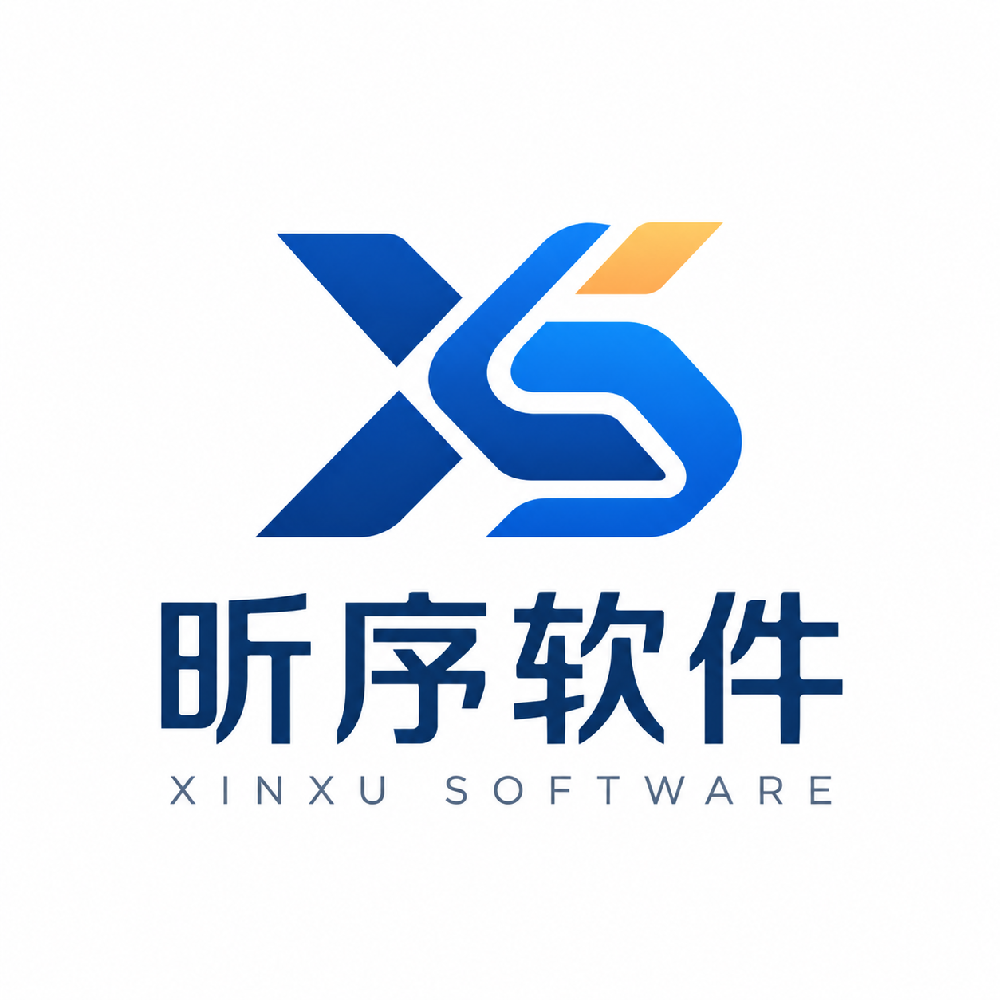

<div align="center">


<h1>ArtFlow</h1>

<p><strong>学院文艺活动全生命周期运行平台</strong> · <strong>Activity operations platform for university arts departments</strong></p>

<p>
  <a href="https://github.com/Zn070515/ArtFlow/actions/workflows/ci.yml"></a>
  <a href="https://github.com/Zn070515/ArtFlow/actions/workflows/integration.yml"></a>
  <a href="https://github.com/Zn070515/ArtFlow/actions/workflows/security.yml"></a>
</p>

<p>
  
  
  
  
  
</p>

<p>
  <a href="#快速开始--setup">快速开始 · Get started</a> ·
  <a href="#先读这些--read-these-first">文档索引 · Docs</a> ·
  <a href="#部署--deployment">部署 · Deployment</a> ·
  <a href="#工程原则--engineering-rules">工程原则 · Engineering rules</a>
</p>

</div>

ArtFlow 是面向学院文艺部的 **EventOps 活动运行平台**：把原本散落在微信群、Excel、Word、问卷星、网盘附件、纸质评分表与主持手卡里的活动工作，收束成一套报名、材料收集、审核、评分、投票、公示、导出与归档都可追溯的在线流程。

第一个生产验证场景是学院十佳歌手大赛与毕业晚会，但 ArtFlow 的目标不是「十佳算分器」，而是一套可长期运行、可复用到多类学院文艺活动的运行平台。产品目标与领域边界见 [GOAL.md](GOAL.md)。

> **项目状态：** 开发基线、验证入口与人工验收范围以 [开发基线](docs/development-baseline.md) 为准。本文档不复述具体的测试数量、commit 或 CI 运行结果，避免它们与代码漂移。

## 先读这些 · Read these first

| 文档 | 它约束什么 |
|---|---|
| [`GOAL.md`](GOAL.md) | 产品目标、领域边界与工程原则基线。 |
| [`CLAUDE.md`](CLAUDE.md) | 编码代理的运行约定与仓库红线。 |
| [`AGENTS.md`](AGENTS.md) | 模块划分、目录职责与贡献准则。 |
| [`docs/development-baseline.md`](docs/development-baseline.md) | 已验证的开发与运行基线。 |
| [`CHANGELOG.md`](CHANGELOG.md) | 按批次记录的权威收敛与行为变更。 |
| [`docs/`](docs/) | 部署、演练、备份恢复与现场运行手册。 |

## 产品方向 · Product direction

| 层次 | 职责 |
|---|---|
| 公开门户 | 公告、往届风采、结果公示与活动入口。 |
| 报名与材料 | 报名表、材料槽、提交文件与材料核查。 |
| 赛制与结果 | 版本化规则图、编译器 / 验证器、resolver 与结果板。 |
| 现场运行 | 快速录分、观众投票、检票入场与手卡抄录。 |
| 导出与归档 | Excel / Word 导出、活动归档与审计留痕。 |

## 核心领域 · Core domains

核心领域分为两条主线：

| 主线 | 覆盖范围 |
|---|---|
| **歌手比赛（`singer_contest` + `ruleset`）** | 把赛制表达为受 schema 约束的版本化 JSON 规则图（`ContestRuleset` / `RulesetVersion`），经编译器 / 验证器检查后可 `FROZEN`，再由 resolver 产生 `HOLD / REVIEW / READY_TO_CONFIRM / CONFIRMED` 结果。2025 院十佳（历史模板 `golden_schidui`）与校十佳屏峰有 Golden 模拟，后台提供 Rapid Score Entry 与 Backstage Result Board 抄卡模式。当年决赛的操作流程见[院十佳决赛生产流程](docs/singer-final-production-flow.md)。 |
| **活动运行（`public_portal` / `files` / `farewell_show` / `voting` / `exports` / `archive` …）** | 报名、材料槽、审核、投票、导出、归档与审计，遵守 Activity 作为 mutation 边界的锁定与权限规则。 |

## 快速开始 · Setup

### Windows 本地启动

以下是唯一的本地 Windows 启动路径；它使用 SQLite，不需要本机 PostgreSQL。

```powershell
Copy-Item .env.example .env
# 在 .env 中替换所有 change-me 占位值，尤其是 DEV_ADMIN_PASSWORD。
uv sync --locked --extra dev
uv run python manage.py migrate --noinput
uv run python manage.py seed_dev_admin
uv run python manage.py seed_demo_data
uv run python manage.py runserver
```

`seed_dev_admin` 从 `DEV_ADMIN_PASSWORD` 读取密码；如果未设置，它会以交互方式要求输入。`seed_demo_data` 是可重复执行的确定性演示数据命令，不是生产初始化步骤。启动后可访问 `http://127.0.0.1:8000/`，并用你在 `.env` 中设置的账户登录。

没有 `uv` 时，先安装它；不要绕过锁文件改用未锁定的依赖安装。`scripts\bootstrap.ps1` 可自动执行依赖同步、迁移和运行诊断，并可通过 `-SeedDemoData` 额外写入演示数据；如需本地管理员，仍运行 `seed_dev_admin`。

本仓库的本地工具基线为 Python 3.12（见 `.python-version`）和 uv 0.11.29；Docker 镜像使用相同的固定 uv 版本。Python 3.13 仍受项目元数据支持并在 CI 中验证。

### 首次管理员 provisioning

商业 / 事件部署直接使用角色注册页面：管理员访问 `/register/admin/` 并填写
`ADMIN_ACCESS_KEY`，工作人员访问 `/register/staff/` 并填写 `STAFF_ACCESS_KEY`，选手访问
`/register/`。技术人员也可以使用一次性 provisioning 命令，不使用 `seed_dev_admin`：

```powershell
docker compose --env-file .env.event -f deploy/compose.event.yml exec web python manage.py provision_first_admin --username event-admin
```

命令会在容器内隐藏式读取密码，只能成功一次，不提供 reset/force 选项，也不会创建
Django superuser。自动化 launcher 可改用 `--password-stdin`，但密码不能放在命令行参数、
镜像、审计或日志中。`seed_dev_admin` 仍只用于本地开发。

## 部署 · Deployment

| 场景 | 编排文件 | 说明 |
|---|---|---|
| 本地 / 联调 | [`docker-compose.yml`](docker-compose.yml) | 固定 `APP_ENV: development`、`ALLOWED_HOSTS: localhost,127.0.0.1`、一个硬编码的本地数据库口令，端口绑定 `127.0.0.1:8000`。 |
| 生产 | [`deploy/compose.production.yml`](deploy/compose.production.yml) | 唯一的生产 manifest，细节见[生产部署说明](docs/deployment-production.md)。 |
| 事件本机 | [`deploy/compose.event.yml`](deploy/compose.event.yml) | 单机现场运行契约，细节见[现场事件部署说明](docs/deployment-event.md)。 |

`docker-compose.yml` **不是**生产部署文件。不要把它当作生产 manifest；在它之上套 `.env.production` 也不能让它变成生产配置。

### Docker PostgreSQL 启动（本地 / 联调）

```powershell
docker compose up --build --wait
Invoke-WebRequest http://127.0.0.1:8000/healthz/
```

容器镜像安装 `production` extra；本地开发安装 `dev` extra。停止服务使用 `docker compose down`。`docker compose down --volumes` 会删除容器数据库、静态文件和上传文件卷，仅可用于明确要丢弃本地容器数据的场景。

对 Compose PostgreSQL 运行完整验收（迁移、诊断、健康检查、演示数据幂等性、显式 reset 安全检查和 Django 全量测试）：

```powershell
pwsh -NoProfile -File scripts\verify_postgres_acceptance.ps1 -StartCompose -VerifyResetSafety
```

该脚本不会停止服务或删除卷；容器只安装 `production` extra，因此测试在容器内使用 Django 的 `manage.py test`，而不是主机 `pytest`。

### 事件本机运行

`deploy/compose.event.yml` 是单机现场运行契约：默认只绑定 `127.0.0.1:8000`，PostgreSQL 不发布端口，数据库和媒体使用持久化卷。购买者应使用 [现场事件部署说明](docs/deployment-event.md) 中的启动壳；只有明确传入 `-Lan` 时，手机才能通过同一私人网络访问。该 manifest 不提供公网入口。比赛期间始终只有这台主机上的一个主数据库/服务器可写。PowerPoint 播放与控制仍独立于 ArtFlow。

```powershell
Copy-Item .env.event.example .env.event
pwsh -NoProfile -File scripts\start-event.ps1
```

## 环境变量

从 `.env.example` 创建本地 `.env` 并替换其中的占位值。模板包含 `APP_ENV`、`SECRET_KEY`、`STAFF_ACCESS_KEY`、`ADMIN_ACCESS_KEY`、`DEV_ADMIN_USERNAME`、`DEV_ADMIN_PASSWORD`、`DEBUG` 和 `DATABASE_ENGINE`；`seed_dev_admin` 使用 `DEV_ADMIN_USERNAME` 和 `DEV_ADMIN_PASSWORD`。模板同时记录了一组**带安全默认值的可选运行参数**，不设置时按默认值运行：媒体交付后端 `ARTFLOW_DELIVERY_BACKEND`（当前仅实现 `local`，其它取值会在启动时报错而不是静默回落）、报名上传配额与保留版本数 `ARTFLOW_UPLOAD_QUOTA_MB` / `ARTFLOW_UPLOAD_MAX_VERSIONS`、媒体卷低水位 `ARTFLOW_UPLOAD_MIN_FREE_MB`、上传限流 `ARTFLOW_UPLOAD_RATE_LIMIT` / `ARTFLOW_UPLOAD_RATE_WINDOW_SECONDS`、个人信息保留天数 `ARTFLOW_PII_RETENTION_DAYS`、现场状态缓存 TTL `LIVE_STATE_CACHE_SECONDS`。管理员和工作人员的浏览器注册/登录分别使用对应密钥；管理员密码应使用浏览器密码字段、隐藏式交互输入或 stdin，不要保存到 tracked 文件。只有选择 PostgreSQL 时才需要 `POSTGRES_DB`、`POSTGRES_USER`、`POSTGRES_PASSWORD`、`POSTGRES_HOST` 和 `POSTGRES_PORT`。

生产环境使用 `.env.production.example` 作为字段清单：`APP_ENV=production`、`DEBUG=False`、真实的主机名和 CSRF 来源、PostgreSQL 连接配置都是必需的；`TRUST_X_FORWARDED_FOR` 只在可信反向代理覆盖客户端 `X-Forwarded-For` 时才设为 `true`。示例值仅是占位符；不得提交 `.env`、密钥、密码、数据库、媒体文件或生成的导出文件。生产拓扑见[生产部署说明](docs/deployment-production.md)。

## 验证与维护 · Verify

```powershell
uv run python manage.py check
uv run python manage.py makemigrations --check --dry-run
uv run python manage.py test
uv run python manage.py doctor
pwsh -NoProfile -File scripts/check_docs.ps1
pwsh -NoProfile -File scripts/verify_postgres_backup_restore.ps1 -ComposeProjectName artflow -BackupPath backups/artflow-rehearsal.dump
```

### 手机布局门禁

现场页面以**手机**为一等终端，所以布局本身也是门禁：七个手机宽度（320 / 360 / 375 / 390 / 393 / 412 / 430，覆盖初代 iPhone SE 到 Pro Max 与主流安卓）各是一个 Playwright project，iPhone 跑 WebKit（iOS Safari 与微信 iOS 的真实内核），安卓跑 Chromium。断言的是**页面不允许整体横向滚动**——表格在 `overflow-x-auto` 内部滚动是允许的（Django admin 的 changelist 也是这么做的）。需要先启动服务：

```powershell
uv run python manage.py migrate --noinput
uv run python manage.py prepare_layout_e2e --output-file test-results\layout-e2e.json
$env:PLAYWRIGHT_LAYOUT_FIXTURE_PATH = "test-results\layout-e2e.json"
uv run python manage.py runserver
# 另一个终端：
npx playwright install chromium webkit
npm run test:e2e
```

不带该 fixture 时 staff 页面会被跳过，公共页面仍会测量。

`doctor` 只读检查配置、数据库、迁移、运行目录和首个管理员 provisioning 状态。匿名探针只返回运行状态，不返回配置或业务数据：`GET /livez/` 表示进程存活（不查数据库），`GET /readyz/` 执行轻量 `SELECT 1` 验证数据库可用，`GET /healthz/` 是 readiness 的历史别名，容器/Caddy/CI 探针继续沿用。演示数据可用 `uv run python manage.py seed_demo_data --reset` 清理，但它只会删除该命令拥有且带测试标记的运行数据；仍应先在非重要数据库中验证。

数据库恢复不能用活动资料归档替代。Docker Compose 环境可用上面的备份恢复命令，把源库恢复到隔离临时容器并运行 Django 检查；该演练不会重置源数据库或卷。完整事件日矩阵见[生产准备演练](docs/production-readiness.md)，备份约束见 [PostgreSQL 备份与恢复演练](docs/postgres-backup-restore.md)。

## 目录结构 · Layout

```
config/              Django 设置、顶层路由与 WSGI/ASGI 入口。
accounts/            自定义 User 模型、角色与登录/注册流。
entry_access/        入场通行证与临时入场会话。
tickets/             票券与检票会话。
core/                Activity 模型与活动阶段、锁定状态。
ruleset/             赛制模板、ContestRuleset、版本化 RulesetVersion 与 resolver。
questionnaire/       问卷 DSL、编译计划、报名草稿与提交、后台设计器。
common/              审计、权限权威、业务规则守卫与生命周期助手。
public_portal/       公开首页、公告、风采与结果公示。
files/               提交文件、材料槽与材料核查。
singer_contest/      歌手报名、轮次、评委、评分与奖项。
farewell_show/       毕晚节目提交与节目单。
voting/              观众投票会话、选项与投票记录。
staff_panel/         工作人员与管理员后台视图。
exports/ archive/ incidents/  导出、归档与异常事件记录。
frontend/            浏览器端 TypeScript 入口（评分、投票、检票等）。
deploy/              生产与现场事件 Compose 契约。
docs/                开发基线、部署、演练与现场运行手册。
scripts/             引导、校验、备份恢复与启动脚本。
```

## 工程原则 · Engineering rules

> ArtFlow 的底线是：**没有无授权的写入，没有绕开受控视图的文件访问，没有静默改写的结果。**

| 规则 | 要求 |
|---|---|
| 权限先于 mutation | 每个写路径进入前先判权限；模板不是授权边界。 |
| Activity 是变更权威 | 写操作先取 Activity 行锁，再服从活动、轮次与投票的锁定状态。 |
| 结果一经核定不可变 | 已 `CONFIRMED` 的赛段结果与公示不再改写；修正走新版本。 |
| 受控文件访问 | 内部文件走受控访问视图，私有媒体不挂静态路由。 |
| 测试数据保护 | 彩排数据与正式数据共存但隔离，离开测试模式前先清零运行时残留。 |
| 操作可追责 | 敏感操作、导出与解锁全部留痕，审计可回答「谁在什么时候改了什么」。 |
| 用户模型 | 使用 `settings.AUTH_USER_MODEL` 或 `get_user_model()`，不要直接引用 `auth.User`。 |
| 不提交运行时产物 | `.env`、密钥、SQLite 数据库、上传文件、导出、归档与生成媒体都不入库。 |
| 文档门禁 | 面向用户的文档改动后运行 `pwsh -NoProfile -File scripts/check_docs.ps1`。 |

## 开发与合并流程

在干净且最新的 `main` 上创建短期分支，完成验证后在分支提交；由负责合并的人以非快进方式合入 `main` 并推送。提交前至少运行 Django 检查、迁移检查、测试和文档检查。完整的数据库、Docker、CI、故障排查和安全说明见 [开发基线](docs/development-baseline.md)。

## 开发与维护 · Built by

<div align="center">



<p>由 <strong>昕序软件科技</strong> 设计与开发。</p>

<p><sub>Designed and developed by <strong>昕序软件科技</strong>.</sub></p>

</div>

